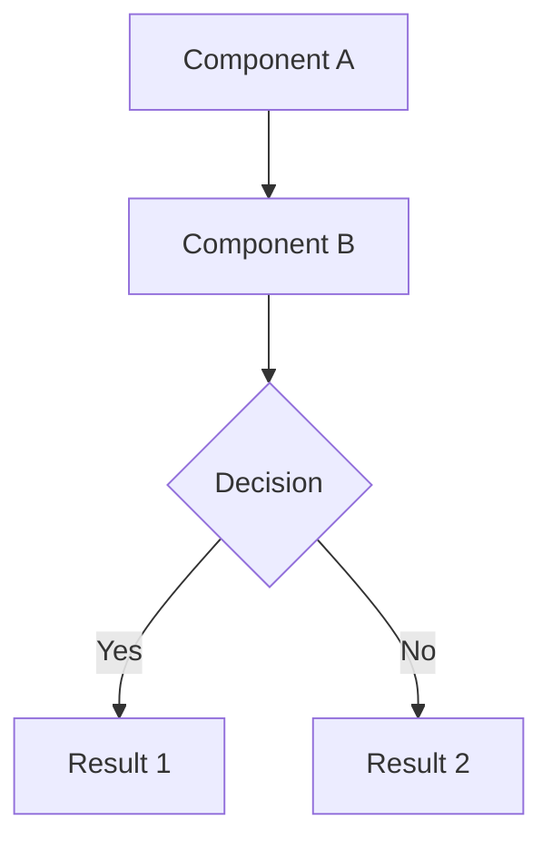
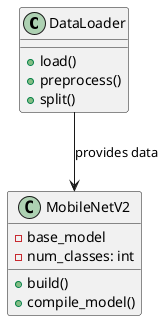

# 🎨 Guide des Diagrammes - Chapitre 3

## ✅ Fichiers corrigés

### Nouveaux fichiers (versions corrigées)
- **[diagramme_architecture_globale_v2.html](diagramme_architecture_globale_v2.html)** ✅ Fonctionne correctement
- **[diagramme_composants_v2.html](diagramme_composants_v2.html)** ✅ Erreur de syntaxe corrigée
- **[diagramme_flux_donnees.html](diagramme_flux_donnees.html)** ✅ Déjà fonctionnel

---

## 🛠️ Plateformes pour modifier les diagrammes

### 1️⃣ Draw.io (app.diagrams.net) - **RECOMMANDÉ** ✅

**Pourquoi ?**
- ✅ **Gratuit et open-source**
- ✅ **Pas de compte requis**
- ✅ **Interface intuitive** (drag & drop)
- ✅ **Export PNG/SVG/PDF** haute qualité
- ✅ **Version en ligne ET desktop** (Windows/Mac/Linux)
- ✅ **Bibliothèques de formes** (UML, flowchart, AWS, Azure, etc.)

**Comment l'utiliser ?**

#### Option A : En ligne (pas d'installation)
1. Aller sur **https://app.diagrams.net/**
2. Choisir "Create New Diagram"
3. Sélectionner un template ou partir de zéro
4. Utiliser les formes dans la barre latérale gauche
5. Exporter : `File > Export as > PNG/SVG/PDF`

#### Option B : Application desktop (recommandé)
1. Télécharger depuis **https://www.drawio.com/**
2. Installer (gratuit, pas de publicité)
3. Créer vos diagrammes hors ligne
4. Sauvegarder en `.drawio` (format éditable)

**Pour recréer mes diagrammes dans Draw.io :**
1. Ouvrir Draw.io
2. Menu `Arrange > Insert > Advanced > Mermaid`
3. Copier le code Mermaid depuis les fichiers HTML
4. Draw.io convertira automatiquement en diagramme éditable !

---

### 2️⃣ Excalidraw - **Pour un style dessiné à la main** ✨

**Site :** https://excalidraw.com/

**Pourquoi ?**
- ✅ Gratuit, pas de compte
- ✅ Style "hand-drawn" moderne
- ✅ Très simple et rapide
- ✅ Export PNG/SVG
- ✅ Collaboration en temps réel

**Quand l'utiliser ?**
- Pour des diagrammes simples et élégants
- Si vous voulez un style moins "corporate"
- Pour des présentations orales

---

### 3️⃣ Mermaid Live Editor - **Pour modifier le code directement**

**Site :** https://mermaid.live/

**Pourquoi ?**
- ✅ Gratuit
- ✅ Aperçu en temps réel
- ✅ Syntaxe simple (comme Markdown)
- ✅ Export PNG/SVG

**Comment l'utiliser ?**
1. Aller sur https://mermaid.live/
2. Copier le code depuis la section `<div class="mermaid">` de mes fichiers HTML
3. Modifier le code (voir syntaxe ci-dessous)
4. Cliquer sur "Download PNG" ou "Download SVG"

**Exemple de syntaxe Mermaid :**


---

### 4️⃣ Lucidchart - **Version professionnelle** 💼

**Site :** https://www.lucidchart.com/

**Pourquoi ?**
- ✅ Interface très professionnelle
- ✅ Templates nombreux
- ✅ Collaboration équipe
- ⚠️ Version gratuite limitée (60 objets max)

**Quand l'utiliser ?**
- Si votre université a une licence
- Pour des diagrammes complexes nécessitant collaboration

---

### 5️⃣ PlantUML - **Pour les puristes UML** 🏛️

**Site :** https://www.plantuml.com/plantuml/

**Pourquoi ?**
- ✅ Standard UML strict
- ✅ Syntaxe texte (versionnable avec Git)
- ✅ Intégration IDE (VS Code, IntelliJ)

**Syntaxe exemple :**


---

## 📥 Comment exporter les diagrammes HTML actuels

### Étapes pour télécharger en PNG (haute qualité)

1. **Ouvrir le fichier HTML dans un navigateur**
   - Double-cliquer sur `diagramme_architecture_globale_v2.html`
   - OU faire clic-droit > Ouvrir avec > Navigateur (Chrome/Firefox/Edge)

2. **Attendre le chargement complet** (2-3 secondes)
   - Le diagramme doit s'afficher à l'écran

3. **Cliquer sur "📥 Télécharger en PNG (haute qualité)"**
   - Le fichier sera téléchargé automatiquement
   - Nom par défaut : `architecture_globale.png`

4. **Placer le fichier dans le dossier figures/**
   ```
   projet/
   ├── redaction/
   │   └── figures/
   │       ├── architecture_globale.png
   │       ├── diagramme_composants.png
   │       └── phase1_preparation.png
   ```

### Si les boutons ne fonctionnent pas

**Solution 1 : Capture d'écran**
- Windows : `Windows + Shift + S` (Outil Capture)
- Mac : `Cmd + Shift + 4`
- Linux : `Shift + PrtScn` ou Flameshot

**Solution 2 : Utiliser Mermaid Live**
1. Ouvrir https://mermaid.live/
2. Copier le code depuis la section `<div class="mermaid">` du fichier HTML
3. Coller dans l'éditeur
4. Cliquer sur "Actions > Download PNG"

**Solution 3 : Console du navigateur**
1. `F12` pour ouvrir la console
2. Vérifier s'il y a des erreurs JavaScript
3. Me les communiquer pour que je corrige

---

## 🎯 Diagrammes manquants pour le Chapitre 3

Vous avez mentionné que pour **3.4 et 3.5** vous montrerez :

### Pour 3.4 - Pipeline d'entraînement sécurisé
**Diagramme nécessaire :** Architecture du pipeline d'entraînement

**Contenu suggéré :**
```
Input Data
    ↓
Preprocessing
    ↓
Data Augmentation ←→ Adversarial Generator (FGSM/PGD)
    ↓
MobileNetV2 Model
    ↓
Training Loop (Standard + Adversarial)
    ↓
Validation & Metrics
    ↓
Model Checkpoint
```

**Créer avec :**
- Draw.io : Template "Flowchart"
- Ou je peux générer un fichier HTML Mermaid pour vous

---

### Pour 3.5 - Déploiement en production
**Diagramme nécessaire :** Architecture de production/déploiement

**Contenu suggéré :**
```
Trained Model (.h5)
    ↓
Docker Container
    ├── Flask/FastAPI Server
    ├── Model Serving
    └── Web Interface
    ↓
API Endpoints
    ├── /predict
    ├── /evaluate
    └── /robustness
    ↓
Client Applications
```

**Créer avec :**
- Draw.io : Template "Network" ou "Cloud Architecture"
- Ou je peux générer un fichier HTML Mermaid pour vous

---

## 💡 Mes recommandations

### Pour votre mémoire (qualité académique)

**Diagrammes d'architecture (3.1, 3.4, 3.5) :**
- ✅ **Draw.io** - Style professionnel, export haute qualité
- ✅ Utiliser des couleurs cohérentes (comme dans mes diagrammes HTML)
- ✅ Police : Arial ou Helvetica, taille 12-14pt

**Diagrammes UML (composants, classes) :**
- ✅ **PlantUML** - Standard académique strict
- ✅ Ou **Draw.io** avec formes UML officielles

**Diagrammes de flux :**
- ✅ **Draw.io** - Formes flowchart standard
- ✅ Ou conserver mes diagrammes Mermaid (déjà corrects)

---

## 🚀 Workflow recommandé

1. **Utiliser mes diagrammes HTML existants** pour architecture globale et composants
   - Ouvrir dans navigateur
   - Télécharger en PNG (2000×1500 minimum)

2. **Créer les nouveaux diagrammes (3.4 et 3.5) dans Draw.io**
   - Cohérence visuelle avec le reste
   - Même palette de couleurs

3. **Tous les PNG dans `figures/`**
   ```
   figures/
   ├── architecture_globale.png
   ├── diagramme_composants.png
   ├── pipeline_entrainement.png  (à créer pour 3.4)
   ├── architecture_production.png (à créer pour 3.5)
   └── dataset_*.png
   ```

4. **Décommenter dans LaTeX**
   ```latex
   \includegraphics[width=\textwidth]{figures/architecture_globale.png}
   ```

---

## ❓ Besoin d'aide ?

**Voulez-vous que je :**
1. ✅ Génère les diagrammes HTML pour 3.4 et 3.5 ?
2. ✅ Crée des templates Draw.io (fichiers .drawio) ?
3. ✅ Convertisse les diagrammes en code PlantUML ?
4. ✅ Crée un script Python pour exporter automatiquement les diagrammes ?

Dites-moi ce dont vous avez besoin !

